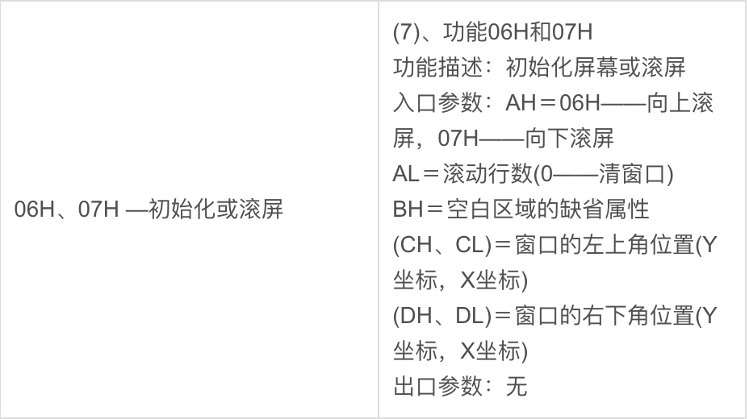
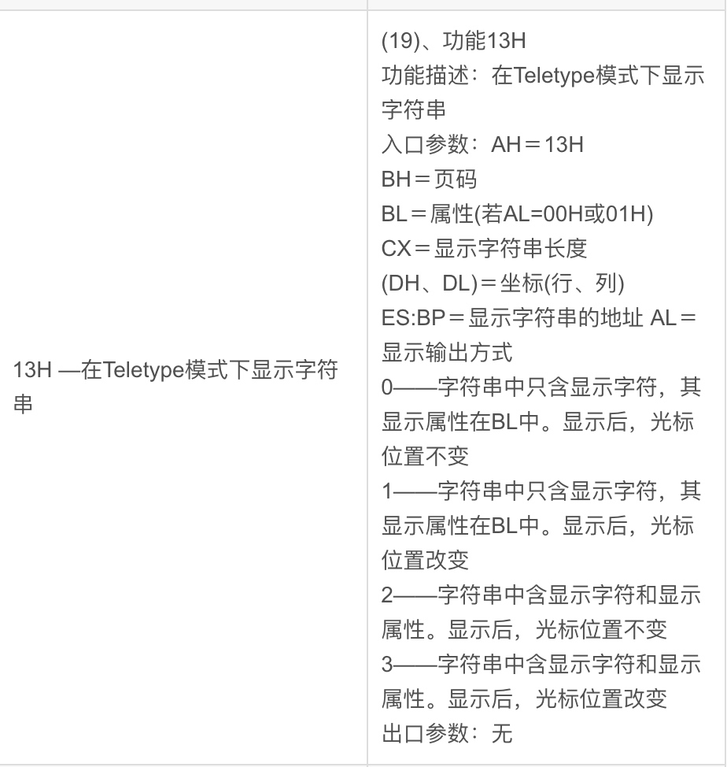

中断功能参考网址： https://blog.csdn.net/MENGmei0219/article/details/126785698

# 中断功能
* int 0x10  显示服务
* int 0x13 直接磁盘服务
以下图为例，调用功能号06H，实现向上滚屏。cx、dx寄存器分别控制窗口的角点位置。


```
    mov ax, 0x600               ;ah中输入功能号  高字节 0x06 
    mov bx, 0x700               ;设置上卷行属性，0x07表示用黑底白字的属性填充空白行
    mov cx, 0                   ;左上角: (0, 0)
    mov dx, 0x184f	            ;右下角: (80,25)
			                    ;VGA文本模式中,一行只能容纳80个字符,共25行。
			                    ;下标从0开始,所以0x18=24,0x4f=79
    int 0x10                    ;int 0x10 显示服务 使用方法 https://blog.csdn.net/MENGmei0219/article/details/126785698
```
# 打印字符串功能



                                ;;;;;;;;;     打印字符串    ;;;;;;;;;;;
                                ;还是用10h中断,不过这次是调用13号子功能打印字符串
    mov ax, message 
    mov bp, ax		            ; es:bp 为串首地址, es此时同cs一致，
			                    ; 开头时已经为sreg初始化

                                ; 光标位置要用到dx寄存器中内容,cx中的光标位置可忽略
    mov cx, 5		            ; cx 为串长度,不包括结束符0的字符个数
    mov ax, 0x1301	            ; 子功能号13是显示字符及属性,要存入ah寄存器,
			                    ; al设置写字符方式 ah=01: 显示字符串,光标跟随移动
    mov bx, 0x2		            ; bh存储要显示的页号,此处是第0页,
			                    ; bl中是字符属性, 属性黑底绿字(bl = 02h,07是黑底白字)
    int 0x10		            ; 执行BIOS 0x10 号中断

字符串打印功能使用bp作为打印字符串地址、cx为打印长度，配置到寄存器值后调用中断号0x10。
# 汇编编译及存入磁盘命令
> nasm -o mbr.bin mbr.S
> dd if=mbr.bin of=hd60M.img bs=512 count=1 conv=notrunc
# mbr加载load
mbr存放在0x7c00


