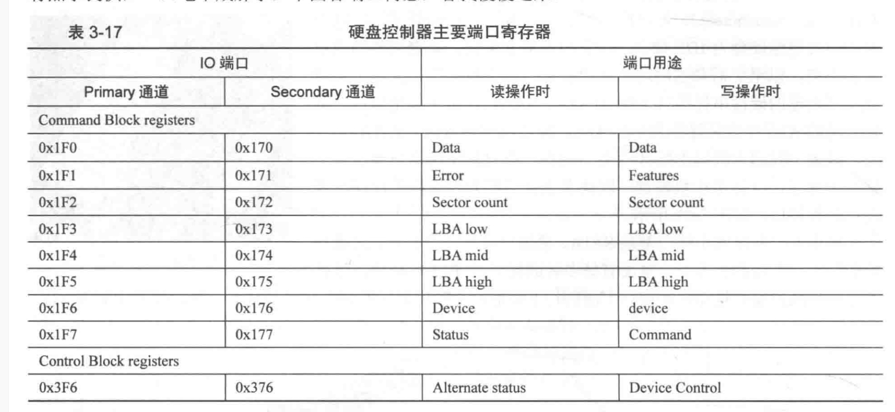
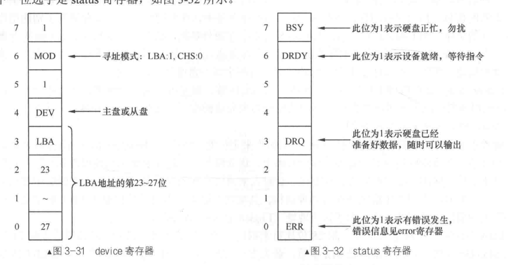

# 读取磁盘

读取硬盘原理是通过out in指令进行写与读。
命令寄存器
 用于向硬盘驱动器写入命令字或读取控制状态。寄存器在读写操作时用处有区别，不同的的通道有不同的端口号。
 * 数据寄存器，用于读写操作时候数据交换。
 * 错误寄存器存储读错误时候的信息，Features寄存器用于写操作时候参数的设置。
 * Sector count用来指定待读取或者待写入的扇区数。
 * LBALow mid high 分别存放LBA寻址的三个字节。LBA28 剩的4位存放在device寄存器中，如下图。
 * device寄存器杂项。指定使用哪个通道和寻址模式。
 * statu寄存器表示硬盘的状态。在写通道操作时用作command寄存器，主要有三个命令：
     * 0xEC 硬盘识别
     * 0x20 读扇区
     * 0x30 写扇区

# 操作顺序
进行磁盘操作的时候规定个顺序，依次写入：
1. 向写入带待操作的扇区数。
2. 将地址写入三个lba寄存器以及device设备寄存器。
3. 设置主通道或者从通道。
4. 向command寄存器中写入命令。
5. 循环检测磁盘状态。
    1. 如果是写操作则完工，读操作则读出数据