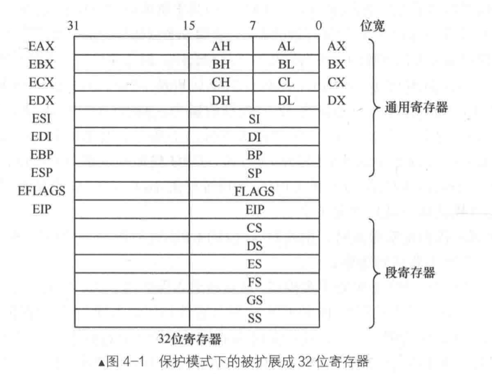
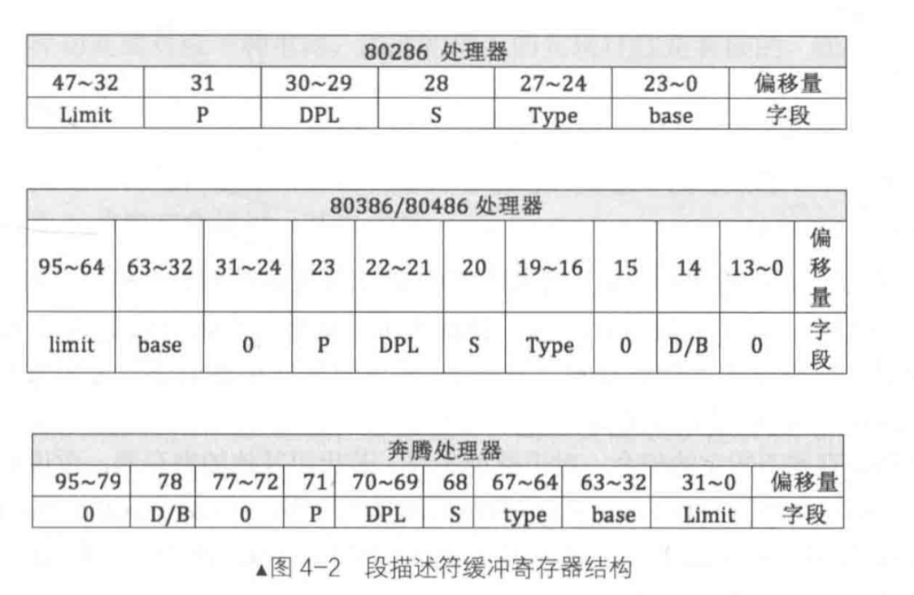
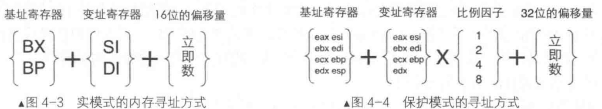
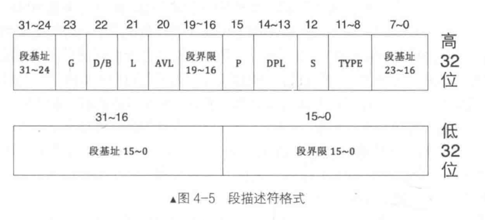
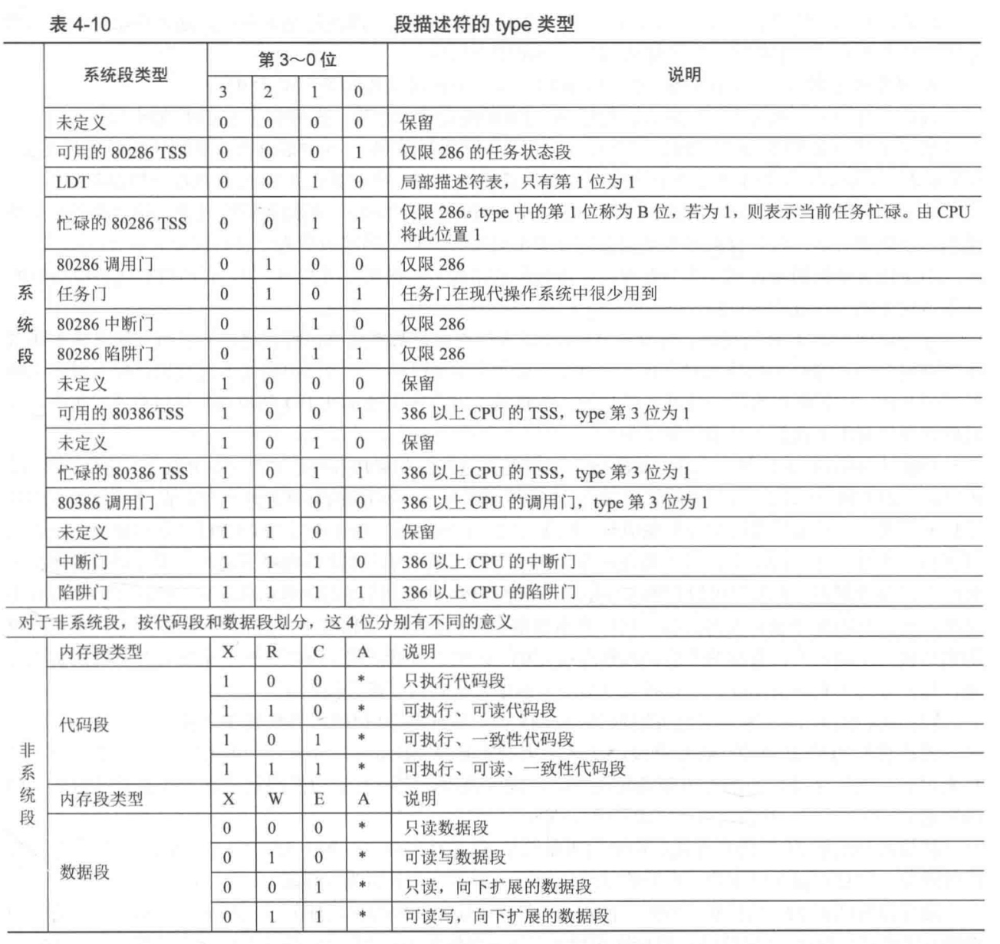
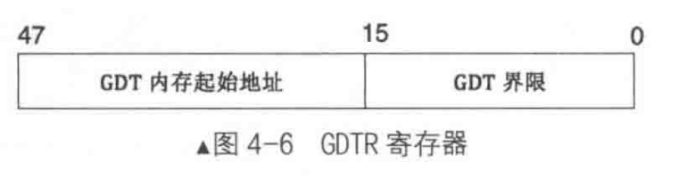
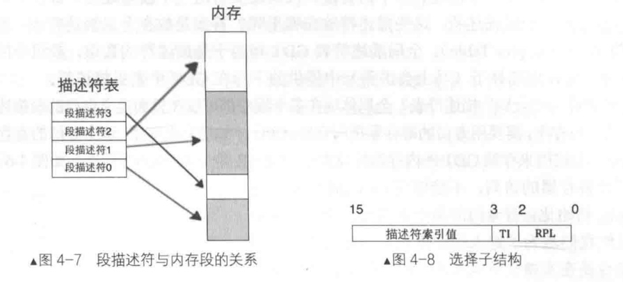
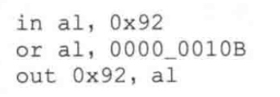
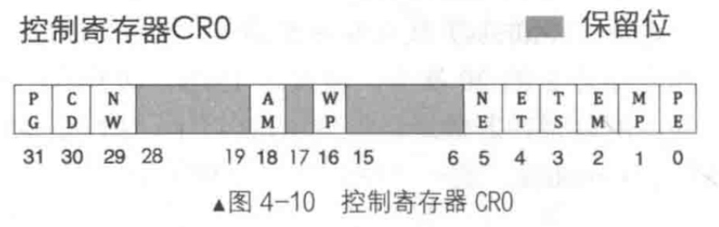
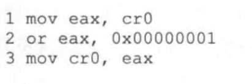

# 实模式 

80286开始有了保护模式，80286的的cpu是16位的，通用寄存器是16位，地址线是24位。80386首款32位处理器，base是32的段集地址。

在保护模式下寻址方式进化了很多。
## 为什么需要保护模式？
* 实模式下用户可以访问任意内存区域，不安全。
* 实模式下用户和操作系统权限一样，不安全。

* 段基地址
* 段界限：20位，单位是4kB或者B。所以段界限为1MB或者4GB。
* S位为0表示系统段，位1表示用户段。
* type段，指定本描述的类型。
* dpl 描述特权等级，4个等级 0最高 3最低。
* P 该段是否在内存中，1表示存在，0表示不存在，该段已经被换出，这是在分页之前的解决方案，分页以4kb为单位换出。
* AVL 软件是否可用。
* L 为1表示64位，0表示32位。
* DB位。如果为代码段就用D位，栈段则为B位，0表示16位，1表示32位。
* G位 表示段界限的单位，0表示一个字节，1表示4kB。

# 全局描述符表及选择字
段描述符存放在全局描述符表GDT中，该表在内存中的地址在寄存器GDTR保存，每个段描述符长度为8个字节， GDT界限是表示GDT所占的字节数。

段寄存器存放选择子。

选择子的结构，RPL存放请求者的特权等级。TI为1表示选择子在gdt中，0表示在lgt中。
地址组成逻辑如下：若选择子为0x08,应放入ds段寄存器，则代表索引为1.若表索引1对应的段基地址为0x1234,则ds:0x09,表示的地址位0x1234+0x09=0x124d。

# A20地址线

开A20地址线，0x92端口第一位置置1. 第一行将0x92端口的值读到al并置位第1位，最后将新的al值写入到端口0x92中。

# 保护模式开关 PE位

开启PE开关，进入保护模式。

# 进入保护模式
